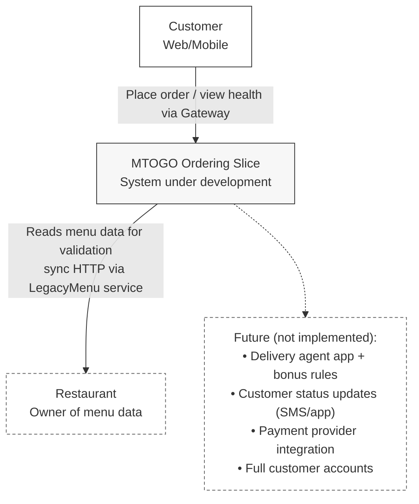

# Diagrams (Mermaid)

These diagrams are used as “living documentation” for the DLS report.
They describe the architecture that exists in the repo (Gateway + Ordering + LegacyMenu), and they clearly mark anything that is future scope as *not implemented*.

## Context (C4-style)


---

## Containers (C4-style)

This diagram illustrates the logical containers and their runtime interactions. It highlights the **YARP API Gateway** acting as the single entry point for all client traffic.

Key implementation details:
* **Synchronous Communication:** The Ordering Service communicates directly with the Legacy Menu Service via HTTP to validate menu items in real-time.
* **Local Orchestration:** The entire stack (Gateway, Ordering, Legacy) is orchestrated locally using **Docker Compose**.
* **Future Scope:** Components such as Payments and Delivery are explicitly marked as out-of-scope for the current iteration.

```mermaid
flowchart LR
  classDef container fill:#f7f7f7,stroke:#333,stroke-width:1px;
  classDef boundary fill:#fff,stroke:#666,stroke-dasharray: 4 3;
  classDef client fill:#fff,stroke:#333,stroke-width:1px;

  U[Client\nWeb/Mobile/Postman]:::client

  subgraph MTOGO["MTOGO (implemented slice)"]
    direction LR
    G["API Gateway YARP\nSingle entry point"]:::container
    O["Ordering Service\nModern service"]:::container
    L["Legacy Menu Service\nLegacy boundary"]:::container
  end

  U -->|HTTP| G
  G -->|HTTP| O
  G -->|HTTP| L
  
  %% FIX: Added quotes around this label to handle the parentheses
  O -->|"Sync HTTP (validate restaurant/menu items)"| L

  D["Docker Compose\nlocal orchestration"]:::boundary
  D -.-> G
  D -.-> O
  D -.-> L

  F["Future (not implemented):\nNotifications, Delivery, Payments,\nshared data stores, message broker"]:::boundary
  O -.-> F
  ```
  --- 

## Component View (Ordering Service)
This diagram looks inside the Ordering Service to show how the code is organized. It follows a simplified "Clean Architecture" or "Onion" style:
- API Layer: Handles HTTP requests and maps them to commands.
- Application Layer: Contains the use cases (e.g., "Place Order"). It   orchestrates the logic but doesn't know about HTTP or Databases.
- Domain Model: The heart of the system. It contains the logic for Order, OrderLine, and validation rules.
- Infrastructure (Integration): Handles the external call to the Legacy Menu Service.


```mermaid
flowchart TB
  classDef comp fill:#f7f7f7,stroke:#333,stroke-width:1px;
  classDef ext fill:#fff,stroke:#666,stroke-dasharray: 4 3;

  subgraph OS["Ordering Service (Mtogo.Ordering.Api)"]
    direction TB
    API["HTTP API Layer\n(Controllers/Endpoints)"]:::comp
    APP["Application Layer\n(Use-cases: Place Order)"]:::comp
    DOM["Domain Model\n(Order, OrderLine, validation rules)"]:::comp
    INT["Integration Client\n(LegacyMenu HTTP client)"]:::comp
    ERR["Error handling\n(Dependency failure -> controlled response)"]:::comp
    LOG["Logging\n(request + dependency outcome)"]:::comp
  end

  LEG["Legacy Menu Service\nHTTP API"]:::ext

  API --> APP
  APP --> DOM
  APP --> INT
  
  %% Optional connections for cross-cutting concerns
  APP --> ERR
  API --> LOG
  
  INT -->|"HTTP"| LEG

  %% Note: persistence intentionally not shown as a dedicated component
  %% unless you actually have a DB/repository abstraction in repo.
  ```
---

## Sequence Diagram.
Part 4: Sequence (Order Flow)
This sequence diagram illustrates the dynamic behavior of the system when a user places an order. It highlights the synchronous dependency between the Ordering Service and the Legacy Menu Service.
- Happy Path: The client sends an order -> Gateway forwards it -> Ordering Service validates the menu items with the Legacy Service -> Success.
- Validation Failure: If the Legacy Service says the item doesn't exist, we return a 400 Bad Request immediately.
- System Failure: If the Legacy Service is down or times out, we handle it gracefully and return a 503 Service Unavailable rather than crashing.

```mermaid
%%{init: { 'theme': 'base', 'themeVariables': { 'background': '#ffffff', 'mainBkg': '#ffffff', 'actorBkg': '#ffffff', 'signalColor': '#333333', 'textColor': '#333333', 'noteBkgColor': '#ffffff'} } }%%
sequenceDiagram
  autonumber
  actor Client as Client (Web/Mobile/Postman)
  participant GW as API Gateway (YARP)
  participant ORD as Ordering Service
  participant MENU as Legacy Menu Service

  Client->>GW: POST /orders (order request)
  GW->>ORD: Forward request (HTTP)

  ORD->>MENU: GET /menu or validate items (HTTP)
  
  alt Menu validation OK
    MENU-->>ORD: Menu/items valid
    ORD-->>GW: 200 OK (order accepted)
    GW-->>Client: 200 OK
  else Validation fails (invalid restaurant/item)
    MENU-->>ORD: Not found / invalid item
    ORD-->>GW: 400 Bad Request (validation error)
    GW-->>Client: 400 Bad Request
  else LegacyMenu unavailable / timeout
    MENU--xORD: (Connection failed/Timeout)
    ORD-->>GW: 503 Service Unavailable (dependency failure)
    GW-->>Client: 503 Service Unavailable
  end
  ```