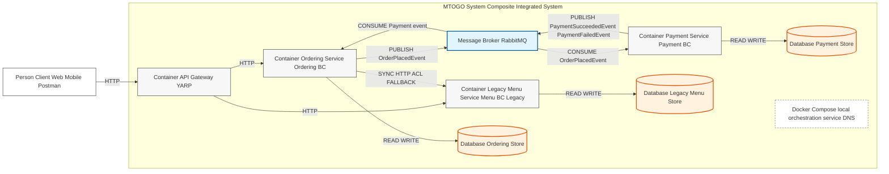

```mermaid
flowchart LR
  classDef person fill:#ffffff,stroke:#333,stroke-width:1px;
  classDef container fill:#f7f7f7,stroke:#333,stroke-width:1px;
  classDef broker fill:#e1f5fe,stroke:#01579b,stroke-width:2px;
  classDef db fill:#fff3e0,stroke:#e65100,stroke-width:2px;
  classDef note fill:#ffffff,stroke:#666,stroke-dasharray: 4 3;

  U["Person Client Web Mobile Postman"]:::person

  subgraph S["MTOGO System Composite Integrated System"]
    direction LR

    G["Container API Gateway YARP"]:::container
    O["Container Ordering Service Ordering BC"]:::container
    R["Message Broker RabbitMQ"]:::broker
    P["Container Payment Service Payment BC"]:::container
    L["Container Legacy Menu Service Menu BC Legacy"]:::container

    ODB[("Database Ordering Store")]:::db
    PDB[("Database Payment Store")]:::db
    LDB[("Database Legacy Menu Store")]:::db

    N["Docker Compose local orchestration service DNS"]:::note
  end

  U -->|HTTP| G
  G -->|HTTP| O
  G -->|HTTP| L

  O -->|READ WRITE| ODB
  P -->|READ WRITE| PDB
  L -->|READ WRITE| LDB

  O -->|SYNC HTTP ACL FALLBACK| L

  O -->|PUBLISH OrderPlacedEvent| R
  R -->|CONSUME OrderPlacedEvent| P
  P -->|PUBLISH PaymentSucceededEvent PaymentFailedEvent| R
  R -->|CONSUME Payment event| O
```